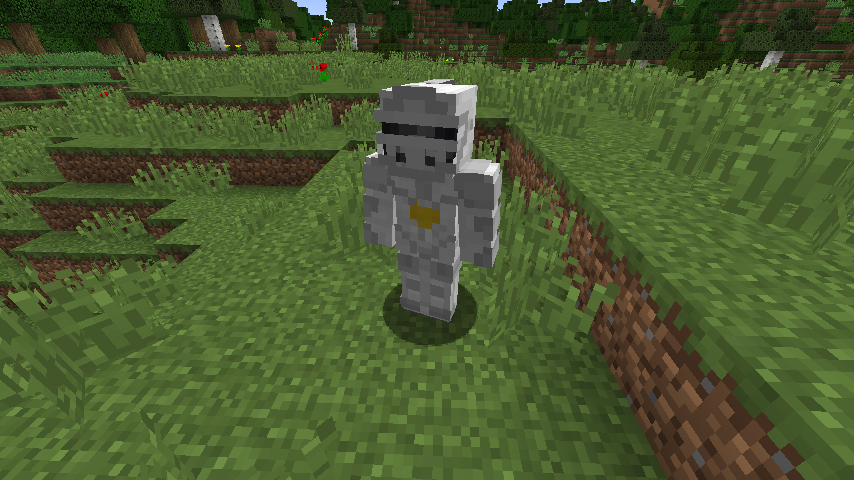
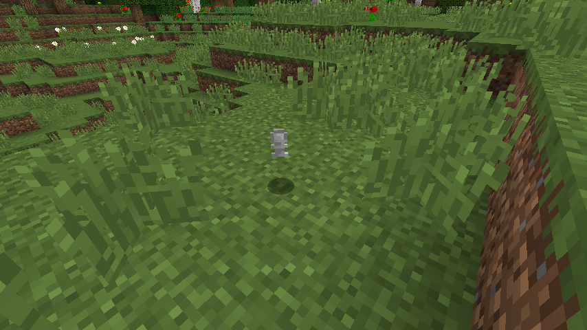
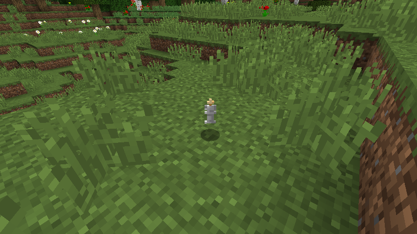
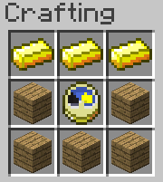
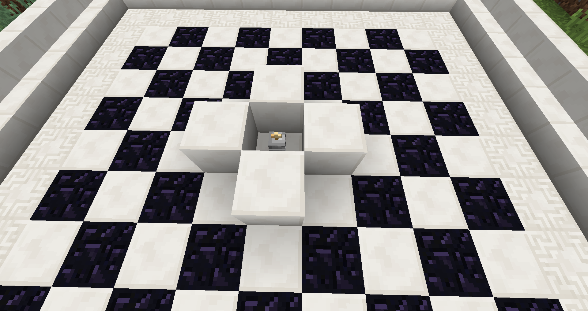
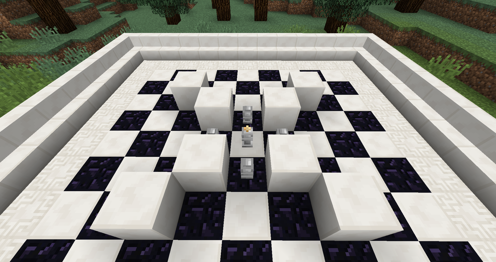
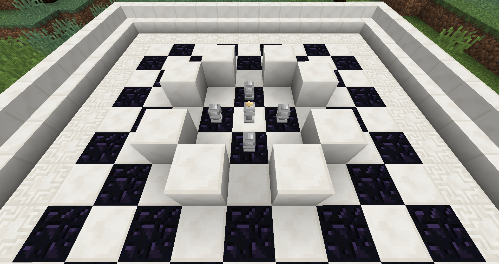
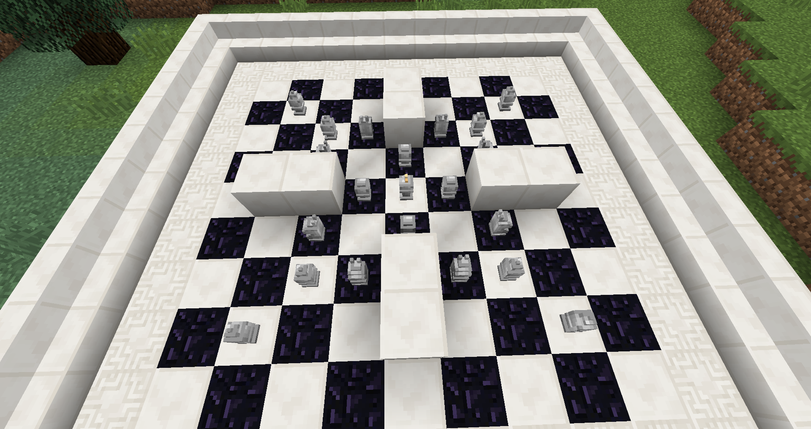

# The Ritual of Chess
The Ritual of Chess is POC for a magic system centered around chess pieces and fighting monsters. Attain pieces, arrange them in mystical arrangements, fight for your life, and finally set your eyes at the price. Once you have your reward, you can either sacrifice it for an amazing frenzy for half a minute, or use it to attain even more powerful pieces.

## Getting started

Okay, so when getting started with TRoC (The Ritual of Chess), you want to find a knight wandering around the world.

These sometimes drop chess pieces. Normally pawns.

But sometimes they might also drop a king piece.

Once you have your first king, you're almost ready to start using rituals. You just need a chess timer first. The timer is supposed to be crafted like so. Sadly we forgot to include the recipe in the ModJam release, so you'll have to get it some other way.

Now you finally have all your pieces, now you want to place them down in a specific pattern. To place a piece, hold shift, and then right click some surface. The different ritual patterns are detailed bellow.

Once you have aranged your pattern, you want to right click the king with your timer. If your pattern is correct, a big king piece will appear over the pattern, and Knights and Vexes will begin to appear. The vexes are your main annoyance (although they mostly spawn at the end of a ritual). The knights while not being too agressive towards you, will try to destroy your chess pieces. If the king is destroyed, the ritual is over, and you need to find a new king.

**If a ritual is too hard for you, you can always cancel it and try again later.** To do this, place down your timer, and right click it near and active ritual. There is no shame in canceling rituals and trying again later.

Once a ritual is over, you will be given an item (currently better chess pieces).

So, what can you do with pieces?
Currently only sacrifice them for carnage. When you hold right click for a given amount of time (same as the worth of the piece), you will sacrifice the piece, and activate a special effect which lasts for a short while. The various effects are listed below.

### Tips
* Don't forget to cancel if stuff gets too hard
* There is nothing wrong with using sacrifices (especially pawn ones) when doing rituals during or right before the activation.

### Rituals
**Reward**: Pawn piece

**Reward**: Bishop piece

**Reward**: Knight piece

**Reward**: Rook piece

**Reward**: Queen piece

### Sacrifices
* **Pawn**: Lot's of enemies will spawn for 15 seconds, then the effect of queen will activate.
* **Bishop**: You heal an insane amount of damage each second.
* **Knight**: Your jump is replaced by a teleport. When you jump, you will instead teleport where you are looking. You can jump normally by sneaking. (Planned deal damage through the path to your destination)
* **Rook**: Increased damage and reach.
* **Queen**: Increased movement speed, attack speed, attack damage, reach, in addition to insane heal.
* **King**: Huge explosion that deals massive damage.

## Future plans
* Some limits on some features like starting rituals (cancelling will always be free)
* More spells outside sacrifices
* Timer recipe
* Some limits on some frenzy effects (knight especially comes to mind)
* More awesome rendering
